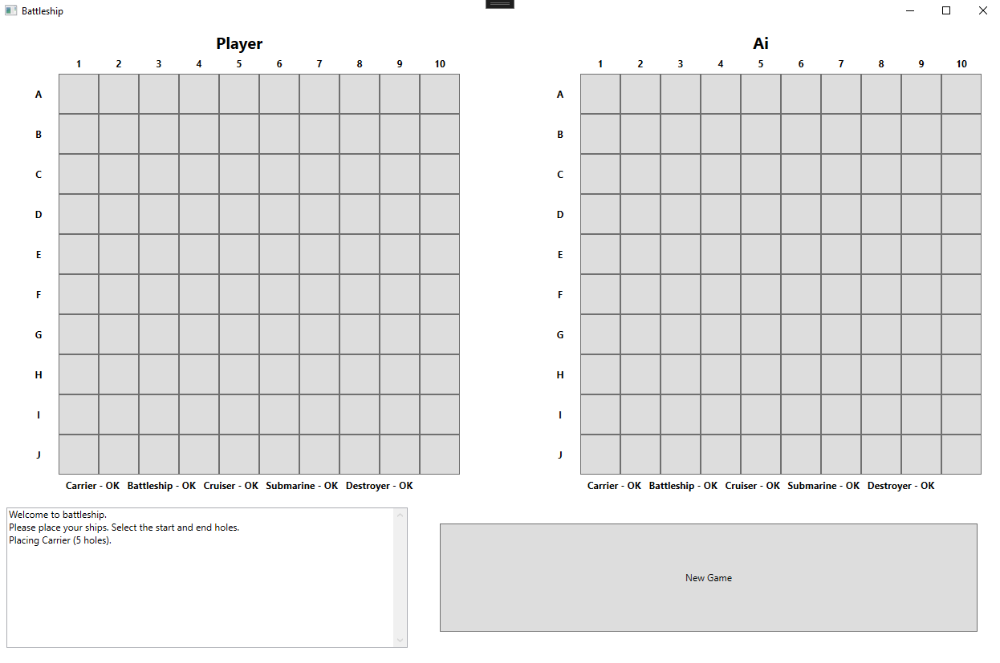
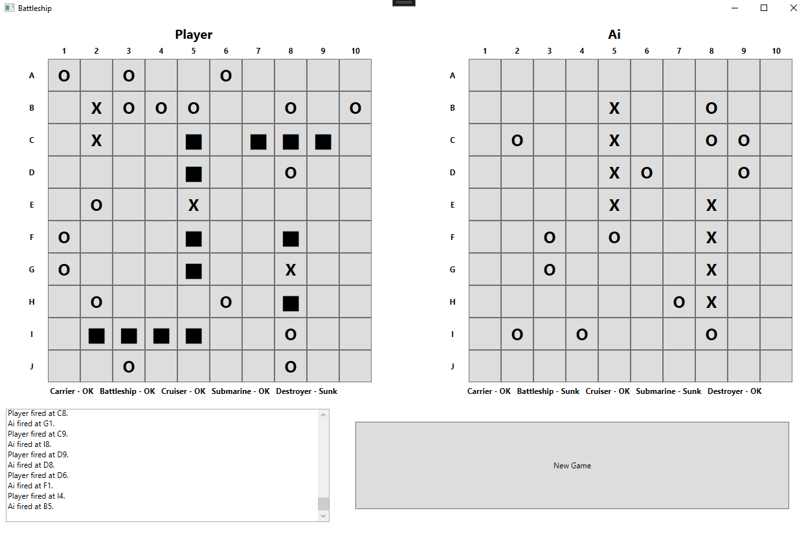
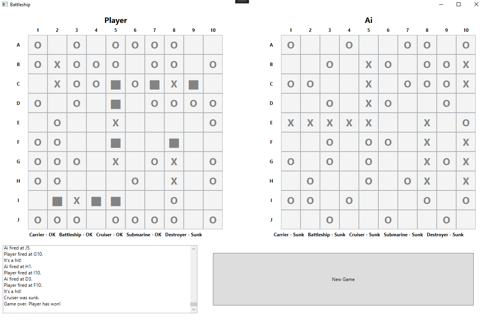

# Battleship-Game

C# WPF application for playing games of Battleship against an AI opponent.

Currently the 'AI' opponent places ships and shoots randomly.

An empty gameboard:

Gameboard during play:

Gameboard at the end of play:
